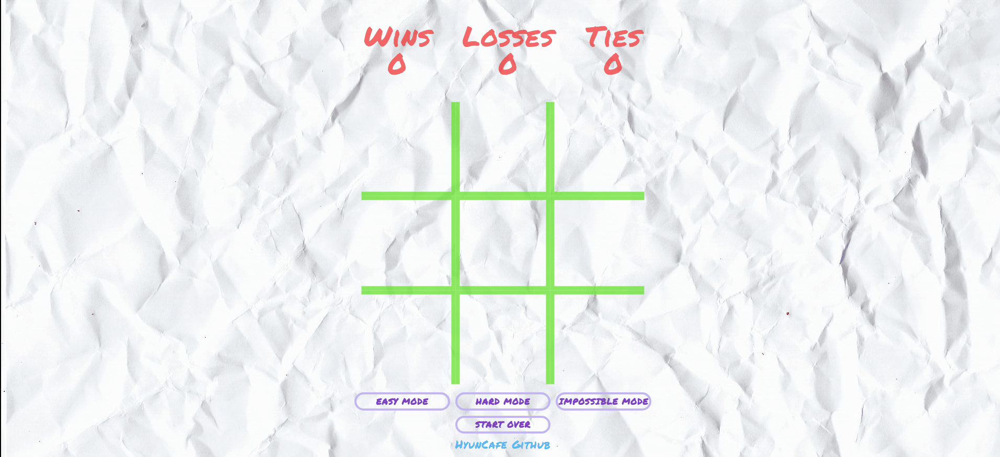

# odin-tictactoe
Through the development of this web-based tic-tac-toe game using HTML, CSS, and JavaScript, I have gained expertise in implementing game logic, state management, user interface design, and responsive web design. My use of descriptive and concise commit messages reflects my understanding of the importance of clean code and effective communication within a team environment. The project timeline showcases my ability to plan, execute, and refactor a project while implementing various features and functionalities. I am committed to producing high-quality code and effective teamwork and am confident in my abilities to contribute to any web development team.

## Summary of Key Features:
* Game board creation and display of results through DOM
* Styling improvements with CSS and optimized grid creation
* Winning logic condition implementation
* Computer player as "O" and human player as "X", with minimum moves required to check win condition
* Closure and win condition state check to ensure proper win condition check after a minimum of 5 moves
* Disabled player moves until computer finishes turn
* Disabling further moves once game is won or lost
* Theme and styling with improved layout and mobile responsiveness
* Overlay for win message and body click for reset and cell reset
* Refactoring of code for better readability and Hard Mode and Reset functionality
* Minmax algorithm implementation for hard mode.

<a href="https://hyuncafe.github.io/odin-tictactoe/" target="_blank">Live Link</a>

## TODO:
* Finish logic for impossible mode

## Project Timeline
#### Mar 7, 2023
* feat: Initial commit with project setup

#### Mar 9, 2023
* docs: Added initial project plan with pseudo code to guide development process
* feat: Implement game board creation and display of results through DOM

#### Mar 10, 2023
* style: Add basic CSS styling to improve the visual presentation of the game and optimize grid creation to improve performance and load times.

#### Mar 11, 2023
* feat: Add unique index attribute to each game cell for future reference
* feat: Style game cells with permanent marker font and X content fill
* feat: Implement functioning winning logic condition for gameplay

#### Mar 12, 2023
* Add: Implemented computer player as "O" and human player as "X", added a minimum of 3 moves required to check for win condition
* : Restructured code to separate computer player logic in preparation for 3 difficulty modes
* Add: Added additional to-do comments for future development
* Add: Implemented a settimeout delay of 0.6 seconds for the computer player's move
* Refactor: Improved game logic by using a closure and win condition state check, ensuring that the game only checks for a win condition after a minimum of 5 moves have been made and that a certain number of moves must be made to achieve a win condition.

#### Mar 13, 2023
* feat: Add feature to disable player moves until computer finishes turn
* feat: Add feature to disable further moves once the game is won or lost
* style: Add theme and styling to the game
* style: Improve layout aesthetics for better user experience
* style: Add mobile responsiveness for better user experience on mobile devices
* feat: Add overlay for win message and body click to reset and cell reset
* fix: Fix bug causing overlay and reset to occur too quickly, remove unnecessary comments
* fix: Fix syntax error that occurs on subsequent game wins after reset.

#### Mar 14, 2023
* Fix: Corrected occasional error occurring when appending DOM on game reset
* Add: Reorganized code and added comment sections for better readability, as well as Hard Mode and Reset functionality for enhanced gameplay options
* Refactor: Removed console logs used for debugging to clean up code
* Fix: Centered win message display for improved user experience.

#### Mar 14, 2023
* Refactor: Refactor hard mode logic to use minmax algorithm

#### Mar 25, 2023
* Fix: Fixed breakpoint and change to fully BEM naming
